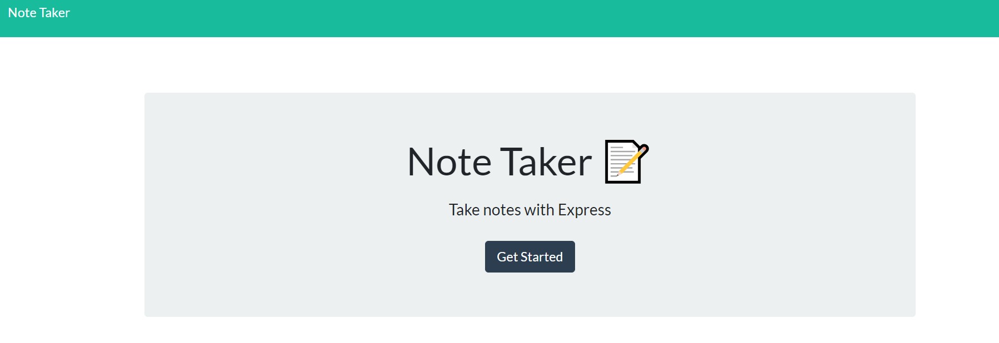
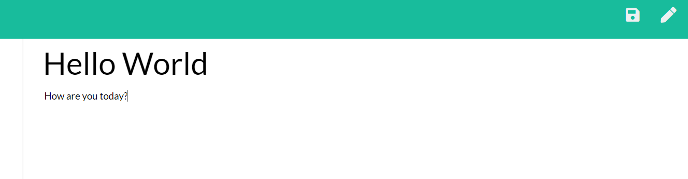
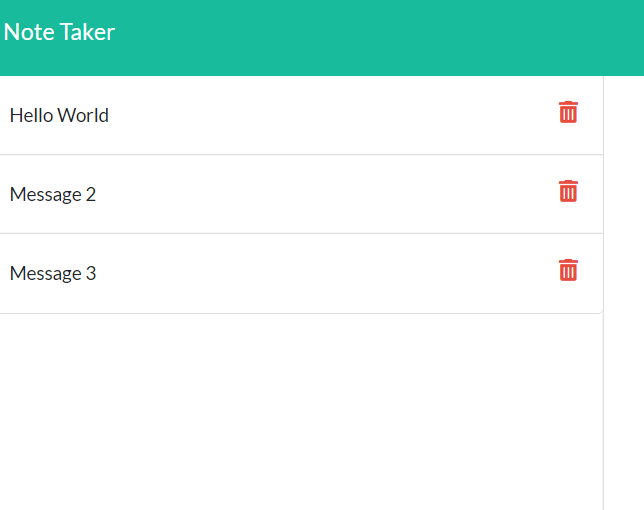

# NoteTaker
This application allows the user to create, save, and delete notes.

## Description
The application presents the user with a welcome screen. The next page shows two inputs: one for title and one for text. The top right of the screen has a new note button, and a save note button once the user starts to type. Once the user saves a note, the note will be displayed on the left side of the screen. A delete note button appears next to the saved note and, once clicked, will delete the note. The notes are being saved to a JSON file on the backend.

### Table of Contents
I. Title
II. Description
III. Table of Contents
IV. Installation
V. Visuals
VI. Usage
VII. License
VIII. Contributing
IX. Test(s)
X. Questions
    
## Installation
The user will need to install the following node packages: express.

## Visuals

    
## Usage
The project functions by taking in user input, saving that input to a JSON file, reading the JSON contents and displaying those contents back to the user.

## License

    
## Contributing
N/A

## Test(s)
N/A

## Questions
If you have any questions, please feel free to contact me below.

Email: alexjoeldelgado@gmail.com

<a href='https://github.com/alexjoeldelgado'>Github Profile: alexjoeldelgado</a>

